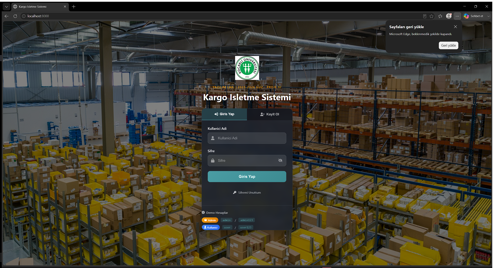
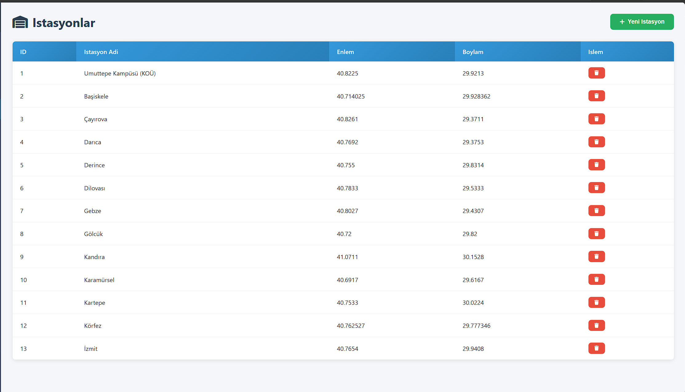
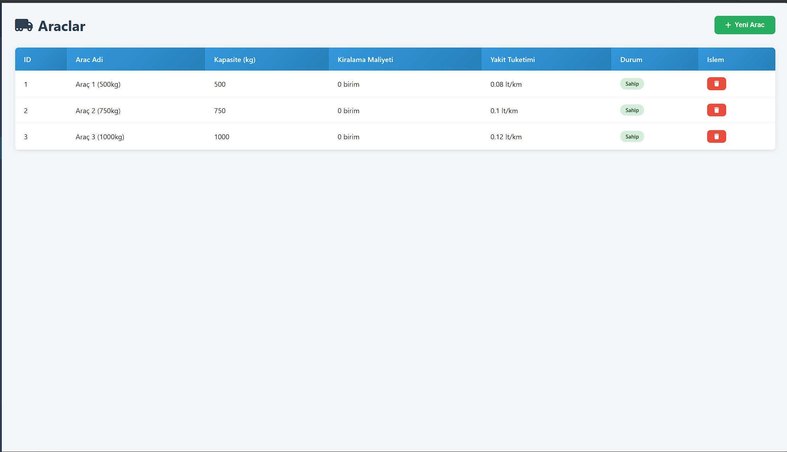
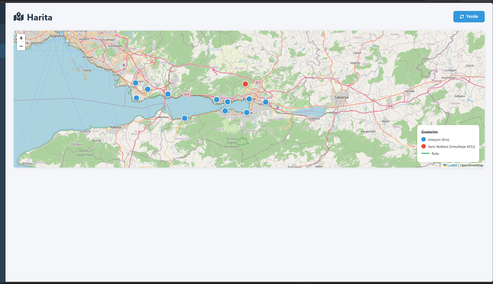
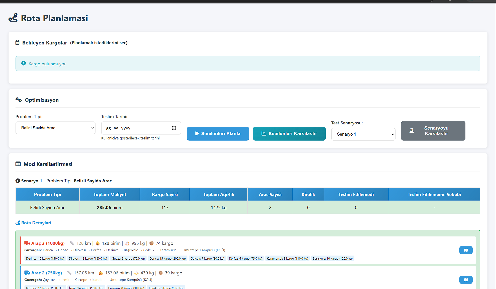
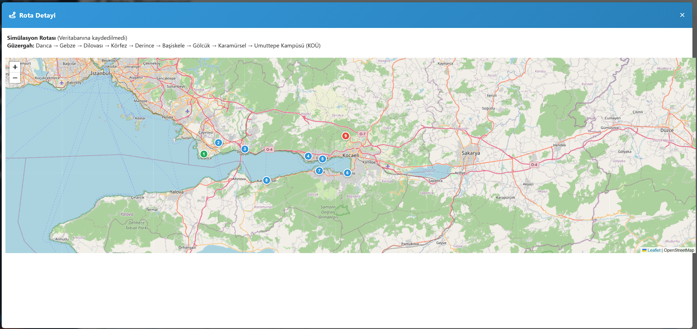
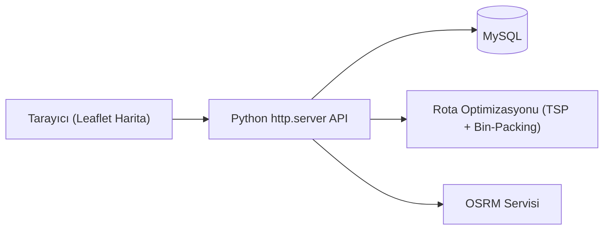

# Kargo İşletme Sistemi

Kocaeli ilindeki istasyonlar arasında kargo dağıtımını planlayan; rota optimizasyonu ve araç yükleme (bin-packing) stratejileri içeren web tabanlı bir lojistik yönetim uygulaması.



## Ekran Görüntüleri

| | |
|---|---|
| **İstasyonlar** — 13 Kocaeli ilçesi | **Araçlar** — 500/750/1000 kg filo |
|  |  |
| **Harita** — Leaflet ile istasyon/varış görselleştirme | **Rota Planlama** — gerçek optimizasyon sonucu |
|  |  |

**Rota detayı haritada:** Darıca → Gebze → Dilovası → Körfez → Derince → Başiskele → Gölcük → Karamürsel → Umuttepe Kampüsü güzergahının numaralandırılmış durak sırasıyla haritada gösterimi:



## Mimari



## Özellikler

- 13 gerçek Kocaeli ilçesi arasında istasyon yönetimi (enlem/boylam ile)
- 500/750/1000 kg kapasiteli araç filosu yönetimi
- Kargoların araçlara atanması
- Rota optimizasyonu: Haversine mesafesi, gerçek yol mesafesi tablosu, en-yakın-komşu + 2-opt TSP sezgiseli
- Bin-packing stratejileri: maksimum sayı / maksimum ağırlık / dengeli dağıtım (küçük girdilerde tam arama, büyük girdilerde açgözlü sezgisel)
- Leaflet tabanlı harita arayüzü, Chart.js ile istatistik grafikleri
- Kullanıcı kayıt/giriş, e-posta ile şifre sıfırlama

## Teknoloji

- Python (stdlib `http.server` üzerine kurulu, framework'süz backend)
- MySQL
- Leaflet.js, Chart.js, Font Awesome (CDN)
- OSRM rota servisi

## 🐳 Hızlı Başlangıç (Docker)

```bash
docker compose up
```

`http://localhost:8000` adresinde açılır, MySQL veritabanı ve tablolar uygulama tarafından otomatik oluşturulur.

## Manuel Kurulum

```bash
pip install -r requirements.txt
```

Ortam değişkenlerini ayarlayın (MySQL ve e-posta gönderimi için):

```bash
set DB_HOST=127.0.0.1
set DB_USER=root
set DB_PASSWORD=your_mysql_password
set DB_NAME=kargo_sistemi
set SENDER_EMAIL=your_gmail_address
set SENDER_PASSWORD=your_gmail_app_password
```

> Not: `SENDER_PASSWORD`, normal Gmail şifreniz değil, Google hesabınızda oluşturduğunuz bir "uygulama şifresi" (app password) olmalıdır.

Ardından çalıştırın:

```bash
python app.py
```

Uygulama `http://localhost:8000` adresinde, veritabanı görüntüleyici ise `http://localhost:8000/db-view` adresinde açılır. Windows'ta `start.bat` ile de başlatılabilir (önce `DB_PASSWORD` ortam değişkenini ayarlamanız gerekir).

## Yardımcı betikler

- `check_db.py` — veritabanı durum raporu
- `fix_db.py` — kargo/rota verilerini temizler
- `update_coords.py` — istasyon koordinatlarını günceller
